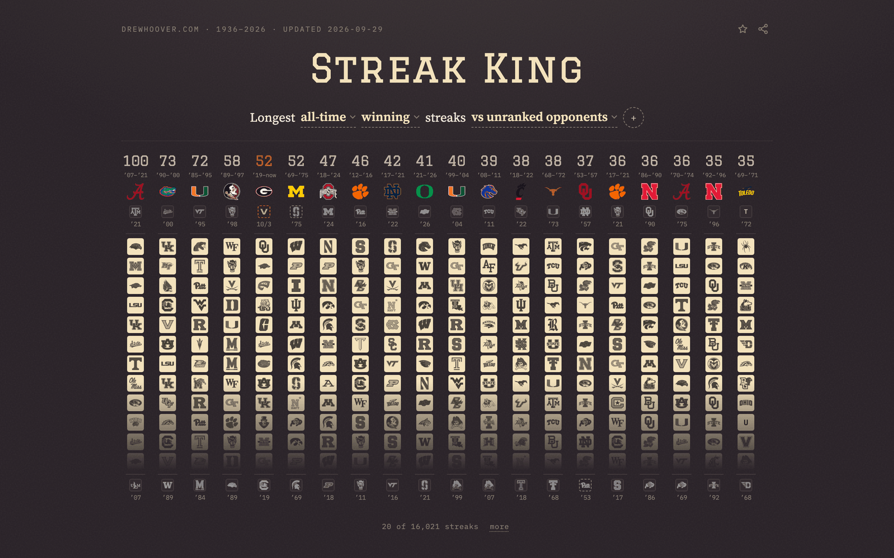

# cfb-streak-king

Design a streak definition out of up to four constraints (on the road, vs
ranked, as an underdog, in November) and rank every current FBS team by its
longest all-time or active winning, losing, undefeated, covering or not-covering
streak under it,
1936 (the first AP poll) to the present.
Each team also gets a page listing the streaks it alone is king of that chance
wouldn't explain, each with its odds. Live at
[drewhoover.com/cfb-streak-king](https://drewhoover.com/cfb-streak-king/).

[](https://drewhoover.com/cfb-streak-king/)

The spec is [specs/cfb-streak-king.spec.md](specs/cfb-streak-king.spec.md);
the research reports behind it are under [specs/research/](specs/research/).

## Data provenance

All raw sources cache under `data/raw/` (gitignored, re-fetchable). The
committed artifacts are `data/payload-base.json` (seasons 1936–2025) and the
versioned rulings under `data/ref/`.

| dataset | source | coverage |
| --- | --- | --- |
| Game spine, scores, sites, 1936–1977 | James Howell's team pages (jhowell.net/cf/scores/, all 305 teams he counts as major in some season). A game between two majors is on both teams' pages; the two agree on every score and date, and on the home team for every campus game but two (Iowa vs Iowa Pre-Flight, 1943–44, who shared a stadium). Off-campus home fields are ruled by `scripts/data/rule-alt-home.mjs` (Rulings). | 27,145 games, 4,985 of them against non-majors |
| Game spine, scores, sites, spreads | Warren Repole's Sunshine Forecast XML (`cfblines.zip` + `bowllines.zip`, recovered via the Wayback Machine; the live site is dead). 78 rows are corrected by `data/ref/repole-errata.json` at parse time (60 wrong scores, 6 blank bowl scores, 10 reversed home teams, 4 wrong lines, 2 wrong dates), each confirmed against Howell and, from 2001, cfbfastR and CollegeFootballData. 38 games the files never listed (1992–93 Big West) come from Howell. Both lists are published, CC0, as [DrewHoo/repole-errata](https://github.com/DrewHoo/repole-errata), regenerated by `scripts/data/export-errata.mjs`; the full comparison is in [Repole data corrections](https://claude.ai/code/artifact/9de4c1d2-d60f-4e4d-85cb-ab2f3bd71a84). | 1978–2013, 25,910 games, 19,904 lined |
| Game spine, kickoff times | cfbfastR-data schedule CSVs | 2002–present (spine 2014+) |
| Spreads | cfbfastR-data `cfb_line_odds.csv.gz`, per-game median closing line | 2006–2025 (2014+ used) |
| Weekly AP polls | collegepollarchive.com pages. Before 1965, and in 1966–67, the final poll came out before the bowls; CPA doesn't date final polls, so `parse-polls.mjs` dates those a week after the last weekly poll. | 1936–present |
| Conference by season, conference-game marks, FBS membership | jhowell.net team pages + byconf.htm ("FBS or the equivalent" per season: the major-college teams before 1978) | 1936–2013 (+membership to present) |
| Head coaches | CFBD `/coaches` (one call, from 1936) + `data/ref/coach-overrides.json` | 1936–present |
| Campus state and timezone | `scripts/data/gen-team-info.mjs`: the current FBS set by hand, other former majors from CFBD `/teams` locations, the rest (dropped programs, wartime service teams) by hand | 304 teams |
| Rivalry pairs | Wikipedia {{Trophy game}} templates | 250 pairs |

Conventions inherited from sibling projects (hostile-territory,
spread-vs-ap): `homeSpread` negative = home favored; cfbfastR UTC dates
resolve to local dates through the home team's timezone; team names
canonicalize through `data/ref/name-aliases.json` and unmatched names are
reported, never dropped.

## Rulings

- `data/ref/alt-home.json`: off-campus sites that count as home (Legion
  Field for Alabama, War Memorial for Arkansas, …). Everything else with an
  off-campus tag is neutral. `parse-repole.mjs` prints the full
  (team, city) frequency table for review.
- Conference game = jhowell's per-game `*` mark before 2009, the cfbfastR
  flag after (it is noisy earlier).
- Scores and home teams for 1978–2013 are a vote: Repole, Howell, and (2002+)
  the cfbfastR schedule. Majority wins; a two-way split goes to Howell. A home
  team flips only on a campus game where Howell puts the designated home on
  the road and no third source disagrees. CFBD's neutral flags before 2005
  are not trusted, and its scores for UNC at Oklahoma 2001 and Cal at Kansas
  State 2003 are wrong.
- A poll dated the day of the game already reflects that game, so the rank in
  effect at kickoff is the previous poll (`rankOf`, `d >= ep`).
- Coach stints come from CFBD `/coaches` records matched as prefixes of the
  team's result sequence (`scripts/lib/coach.mjs`). A lone CFBD row at least
  two games short of the season is treated as unresolved, and
  `data/ref/coach-overrides.json` rules every unresolved season: dropped
  coaches, bowl-only interims, and seasons CFBD has no rows for. `x:<name>`
  ids mint coaches CFBD never lists. The build must report 0 unresolved.
- Before 1978, Howell writes "vs." on both pages for every off-campus game, so
  nobody says whose home game it was. A city is a team's regular home field
  when it's in the team's state and the team played at least 5 regular-season
  games there against at least 3 opponents (`rule-alt-home.mjs` writes the
  65 pairs into `alt-home.json`'s `howellEra`). A game at a city both teams
  claim, or neither, is neutral; so are three annual neutral-site series
  (Florida–Georgia in Jacksonville, Army–Notre Dame at Yankee Stadium,
  Arkansas–LSU in Shreveport).
- A game with no AP poll in effect for a team (the first weeks of every season
  before 1950, when there was no preseason poll) has an unknown rank; rank
  chips skip it. "Ranked" means ranked in that week's poll: top 20 through
  1960, top 10 in 1961–67, top 20 through 1988, top 25 since.
- Ties (pre-1996) end winning and losing streaks. The third outcome,
  undefeated, counts wins and ties (Alabama's 31 straight, 1991–93, through
  the 17–17 tie at Tennessee).
- A covering streak counts games where the team beat the closing spread
  (margin plus the team's line above zero). A push ends it. A game without a
  line is invisible to it, as it is to the betting chips, so covering
  streaks start no earlier than 1978. A not-covering streak counts the
  games where the team failed to cover, under the same rules.
- A team's list starts at its latest FBS entry (`windowStartOf`). FCS-era games
  stay in the payload for the FBS opponent but never in the team's own
  list, so Missouri State's streaks begin in 2025, not in its FCS years.
  Howell ends a span on any season he doesn't list, so seasons a team sat
  out (WWII 1943–45, UConn, ODU and NMSU 2020, SMU 1987–88, UAB 2015–16) are
  bridged by `data/ref/fbs-span-bridges.json`, one source per row. So are the
  wartime seasons a school counts but Howell doesn't list as major (BC,
  Miami, Washington, New Mexico, New Mexico A&M 1943; Vanderbilt 1943–44;
  Arizona 1945); their games, and NMSU's two spring 2021 games, come from
  `data/ref/extra-games.json`, each with a source and quote.
- A streak reaching 1978 displays as "N+"; one reaching a later FBS entry
  says so in the panel.

## Validation

`npm test` (Vitest) runs against the payload that ships, in CI after the
season refresh: the known answers below through the client's own decode, a
sweep of every parameterless definition through the sentence builder, URL
round-trips for every chip, crowns cross-checked against the boards, and a
prerender-then-hydrate check that fails on any mismatch. `npm run typecheck`
checks `src/lib` (TypeScript; components are still JSX).

Known-answer checks also run inside `build-payload.mjs` and fail the build
before it writes `payload-base.json`: Oklahoma's 47 straight wins (ended
1957-11-16 by Notre Dame), Kansas State's 28 straight losses (ended
1948-10-09 against Arkansas State),
Alabama's 100 straight wins over unranked teams (ended 2021-10-09 by Texas
A&M), Kansas's 46-game road losing streak (ended 2018-09-08 at Central
Michigan), Vanderbilt's 26-game SEC losing streak (ended 2022-11-12 by
Kentucky). The Repole XML parse also cross-checks against the independent
CSV parse from spread-vs-ap (25,910/19,904 exact match).

## Pipeline

```
node scripts/data/parse-repole.mjs     # repole XML -> data/build/spine-1978-2013.json
node scripts/data/parse-schedules.mjs  # cfbfastR CSVs -> data/build/schedules-2002-2026.json
node scripts/data/parse-jhowell.mjs    # team pages + byconf -> conf/fbs/marks
node scripts/data/parse-polls.mjs      # CPA pages -> data/build/polls.json (from FIRST_SEASON)
node scripts/data/parse-rivalries.mjs  # wikitext -> data/build/rivalries.json
node scripts/data/gen-team-info.mjs    # -> data/ref/team-info.json (state + tz; reads data/raw/cfbd-teams.json)
node scripts/data/rule-alt-home.mjs    # Howell-era home fields -> data/ref/alt-home.json howellEra
node scripts/data/fetch-cfbd-boxes.mjs # CFBD /games + /games/teams -> data/raw/cfbd-games, cfbd-teamstats
node scripts/data/parse-boxes.mjs      # line scores, OT periods, possession -> data/build/boxes.json
node scripts/data/parse-coaches.mjs    # CFBD /coaches -> data/build/coaches.json
node scripts/data/build-payload.mjs    # join everything -> data/payload-base.json (committed)
node scripts/data/build-current.mjs    # + in-progress season -> src/data/payload.json (CACHE=1 for offline)
node scripts/data/export-errata.mjs <dir>  # -> the DrewHoo/repole-errata checkout
node scripts/gen-logos.mjs             # one-color marks -> public/logos/<espnId>.png, color -> public/logos-color/ (then build-current again)
npm run gen:og                         # og.png, card.png, public/og/team/<id>.png (committed)
npm run build                          # vite build + prerender (root, 136 team pages, sitemap)
```

The window's first season is `FIRST_SEASON` in `scripts/lib/window.mjs`; the
client reads it from the payload.

CI runs only `build-current.mjs` (it fetches the current schedule CSV, AP
poll pages, and CFBD lines, coaches and box scores) before `npm run build`,
on push and on a twice-weekly cron. That step is allowed to fail: the script
exits before writing when the season has completed games and no lines at
all, and the build then uses the committed payload. Its log line
`payload: +N completed … (M lined)` is the thing to check after a deploy.

## Not here yet

- Per-definition social previews. Crawlers read the exact URL's HTML and
  GitHub Pages ignores query strings, so only the root and `/team/<id>/`
  have their own image. The plan is a Cloudflare worker in front of Pages
  that rewrites `<head>` for query-string URLs and renders the PNG on a
  second route; it needs the domain's DNS on Cloudflare.
- A "vs FBS opponents" chip (FCS games count only as losses).
- Streaks of failing to cover, and over/under streaks.
